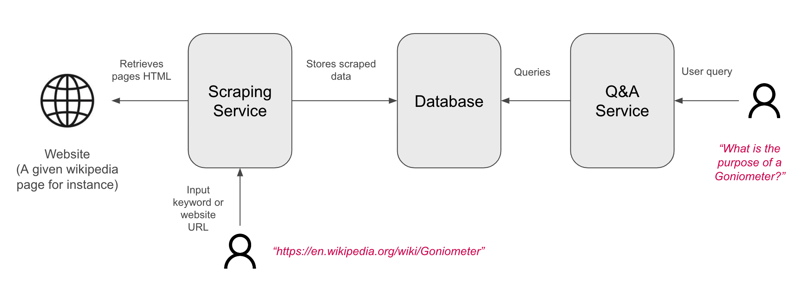

# Interview-ai-engineering
This repository hosts the instructions for the AI engineering technical test. 

## Overview

The general idea of this exercise is to demonstrate your ability to create and package a RAG stack, by buidling an _assistant with expertise on a given website_. 

Here is a suggested architecture to build such a system:

## How will this stack be used ?

#### Step 1 - Fill in knowledge base 🌐
Pass a keyword or website URL to the *Scraping service* to fill in your data store.

#### Step 2 - Ask a question 🙋
Ask a question to the Q&A service and get a reply with information from the data store.

## Requirements & tooling

Please use :
- Python
- [Docker](https://www.docker.com/get-started)

For the rest, please make your own choices :
- try to prioritize open-source solutions,
- but feel free to use external APIs such as OpenAI (☝️ don't hesitate to ask us for some API keys).

## Objectives

The result of this work should be a packaged version of your application, containing a clear README.

The interviewer should be able to easily run your stack in a minimum amount of steps (`docker-compose` is a good option here). 

Once the app is up, the interviewer should be able to :
- fill in the knowledge by invoking your scraping service with keywords/URLs
- get answers to questions concerning his data source

## Evaluation criteria & constraints

- Clarity and efficiency of your instructions (README file) - to allow the interviewer to spawn the app without any assistance, in an efficient way (as few steps as possible)
- Robustness of your services: we will be interested to see how they react when we pass different website, and different queries
- The performance of the model itself (its ability to give accurate answer) will **not** be a crucial part of the evaluation.

 ## How to submit your proposal

Please clone this repository locally, commit your changes in a new branch, and return us a compressed version of the updated repository by email.